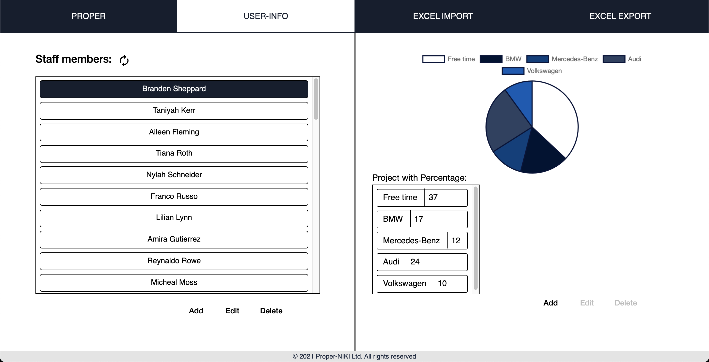
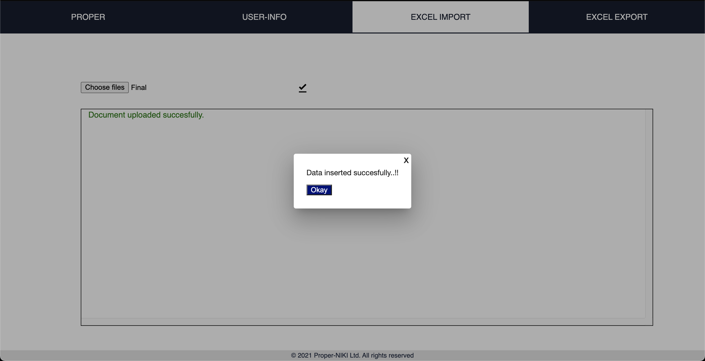

# Proper-Application
#### Internship at Niki Digital Engineering 
Developed a human resources management application, considering the working time of the company's employees. The purpose of the app was to achieve better scheduling and task assignment. The implementation was developed on Angular 8 with MongoDB as a Database.

